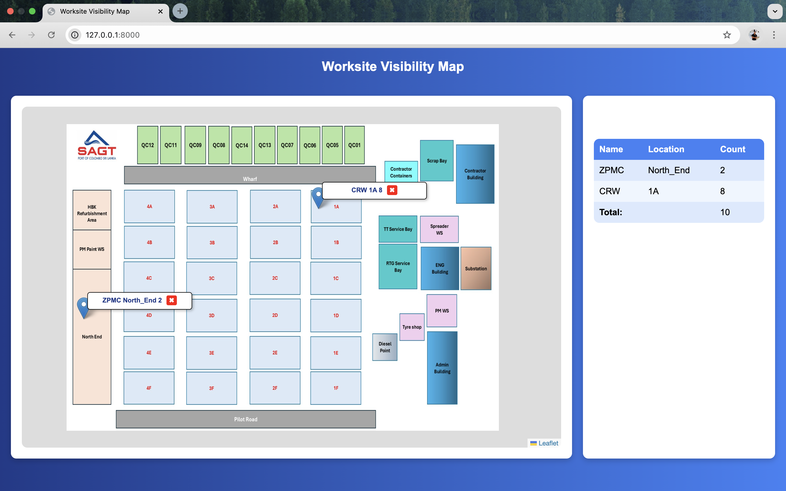

# Contractor Visibility Map  

## Overview  
Worksite Visibility Map is a real-time monitoring system that allows users to track the locations of contractors working on a site. The application features an interactive map where users can add, move, and remove contractor markers while keeping data synchronized across all connected clients.  

## Features  
✅ **Real-time marker updates** via WebSockets  
✅ **Custom map overlay** for site-specific tracking  
✅ **Draggable markers** for easy repositioning  
✅ **Interactive table** that updates dynamically  
✅ **Persistent data storage** during the session  

---

## **Installation & Setup**  

### **1. Clone the Repository**  
First, clone this repository and navigate to the project folder:  
```sh
git clone https://github.com/dev-pa5an/Worksite-Visibility-Application-WS.git
cd app2.0
```
### **2. Create a Virtual Environment (Optional but Recommended)**  
To keep dependencies organized, it's best to create a virtual environment:

```sh
python -m venv venv
```
Then activate it:

**On macOS/Linux:**
```sh
source venv/bin/activate
```
**On Windows:**
```sh
venv\Scripts\activate 
```
### **3. Install Dependencies**
Install all required Python packages using:

```sh
pip install -r requirements.txt
```
### **4. Run the Application**
Start the Flask-SocketIO server:

```sh
python server.py
```
The server will run at **http://localhost:8000**. Open this URL in your browser.

### **Usage**

#### Add a marker – Click anywhere on the map, enter contractor details, and save.
#### Move a marker – Drag a marker to update its location.
#### Remove a marker – Click the ✖ button to delete a marker. The table entry will also be removed.
#### Monitor the table – View contractor details in a dynamically updating table.

---

## **Screenshot**  


